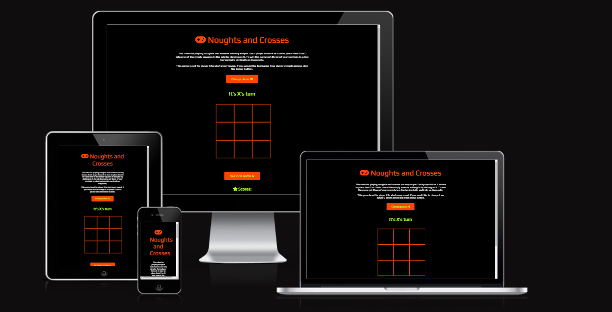
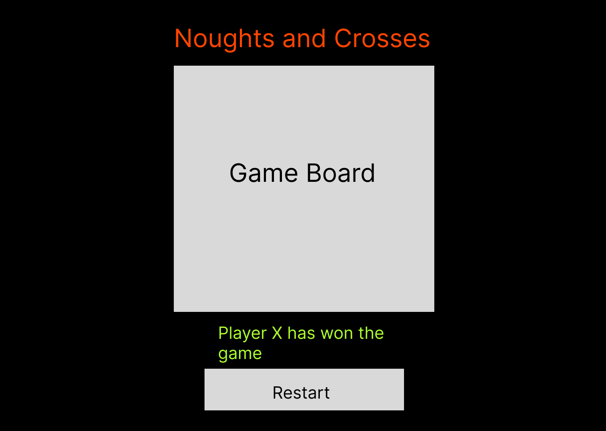
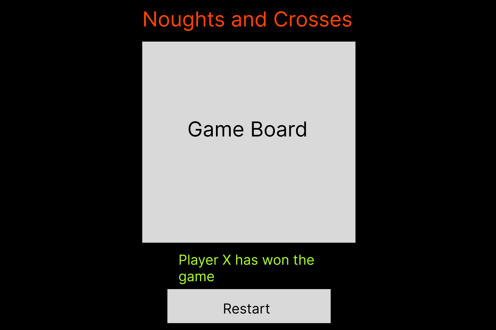
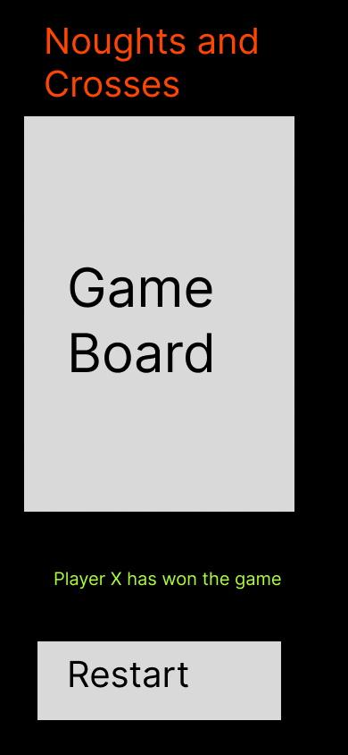

# Noughts and Crosses

## Code institute / City of Bristol College Milestone Project 2

*Created using* [Am I Responsive](http://ami.responsivedesign.is/)

Noughts and Crosses is my interactive JavaScript game created as part of my second milestone project for the full stack development course at Code Institue / City of Bristol College. I had to create an interactive web application using HTML, CSS and JavaScript.

Click <a href="https://gazerb.github.io/noughts-and-crosses/">here</a> to view the live web application.

## User Experince 
In this section, I will be providing information on the UX process. Focusing on who the PeakMotion website is for, the main aims of this project and how the website helps to meet the users needs.

The Project Goals:
<ul>
    <li>To provide access to an online noughts and crosses game</li>
    <li>Easy to understand and use</li>
    <li>appeal to all ages</li>
    <li>Fully interactive to keep people using the application</li>
</ul>

## User stories

A new user:
<ul>
    <li>I need to find a noughts and crosses game that is easy to user</li>
    <li>I need to find a noughts and crosses game that is appealing</li>
    <li>I need to know what facilities are available</li>
</ul>

#### Returning users

Current user:
<ul>
    <li>I want to be able to continue to use the game with friends</li>
</ul>

Buisness Owner:
<ul>
    <li>A noughts adn crosses game that has a retro game style with colours</li>
    <li>To be interactive and can run continuos games</li>
</ul>

## User Centered Design
### 1. Strategy Plane
The User Centered Design process started with the creation fo the user stories and these influenced the design, layout and colours of the product.

### 2. Scope Plane
Find an online version of the classic noughts and crosses game that is easy to use and understand with appealing colour schemes.

### 3. Structure Plane
After idenifying the needs of the users and visiting other local sports center websites the below features were chosen for the website:
<ul>
    <li>Child friendly and retro colour scheme</li>
    <li>Game board is easy to see</li>
    <li>Display message that shows whos turn it is</li>
    <li>Display message to show the game result and how to play again</li>
</ul>

### 4. Skeleton Page
To create the wireframes for the product I used <a href="https://www.figma.com/>">Figma</a>. They were created to appear as they would on a desktop, table and mobile.

The wireframes show the title, gameboard and display message which will change depending on the game situation. They also show a reset button to start the game again.

### Wireframes

This is how the product will look on a desktop device once completed.

This is how the product will look on a tablet device once completed.

This is how the product will look on a mobile device once completed.

### 5. Surface Plane
#### Design
As this product is considered a interactive game and most users will be on a portable device, a mobile-first approach was used.

#### Colour Scheme
The colour scheme was chosen to be simple, clean, bright and visually appealing. Blue is thr traditional colour associated with sports centers with swimming pools so this was chosen along eith white as this is a clean color. Black was chosen for the text and related icons

*Colour palette created at* [coolors.co](https://coolors.co/7ae9f0-04c6d3-fafafa-0420d4-000000).

<ul>
    <li>#7AE9F0 / Electric Blue. A nice bright color chosen for the navigation bar</li>
    <li>#04D6C3 / Dark Turquoise. A darker shade of blue chosen for the footer. It was also chosen to highlight the active page the user is on</li>
    <li>#0420D4 / Medum Blue. Chosen for the social icons in the footer to make them stand out. It is also the colour that shows when you hover over a page in the navigation bar</li>
</ul>

#### Icons
Icons were used alongside teat to help the user understand sections of the website at a glance. I have taken the icons used in this project from Font Awesome (https://fontawesome.com/).

#### Typography
After some research, I found that the 4th most common font used on gym and sports websites is Monserrat. I decided to go with the 4th most used as i wanted this website to be similar but also slightly different, This font was used for the logo and navigation bar. Google fonts recommended Roberto as a secondary font so this was used for the body of the website.

## Development
During a mentor session it was advised to me that when in tablet mode I should have a drop down hamburger menu similar to when in mobile mode. This will help the website with responsiveness and look more professional. 

I was also advised during the same session to change the layout to only show two images per row. This would mean the the responsiveness of the website would be better and the images would not appear stretched or pixelated.

### Site Map

## Features
### Consistent features on all pages
<ul>
    <li>Title, displaying on the webpages tab is the title of the website</li>
    <li>Header, contains the same company logo and navigation bar</li>
    <li>Footer, Contains company address, contact number, email, opening times and social links</li>
</ul>

### Features per page
Index:
<ul>
    <li>Hero Image - to improve the look of the website</li>
    <li>Images of the gym, pool and fitness classes with links to relevant pages</li>
</ul>

Gym.html:
<ul>
    <li>Images of the gym facility</li>
</ul>

Pool.html:
<ul>
    <li>Images of the pool facility</li>
</ul>

Fitness-classes.html:
<ul>
    <li>Images of different taking place in our facility</li>
</ul>

Gallery.html:
<ul>
    <li>3 sections containing images of the gym, pool and fitness classes</li>
    <li>Video of a fitness class taking place</li>
</ul>

Contact-us.html:
<ul>
    <li>Full screen contact form to get in touch with any quieries.</li>
</ul>

## Future Features
<ul>
    <li>Online membership sign up with payment option</li>
    <li>Online class timetable</li>
    <li>To be able to book a class online through membership</li>
    <li>Online facility reviews</li>
</ul>

## Technologies used
The below languages were used in this project:
<ul>
    <li>HTML</li>
    <li>CSS</li>
    <li>JavaScript - Imported from Bootstrap and used for the hamburger menu</li>
</ul>

## websites used
<ul>
    <li>Am I Responsive (http://ami.responsivedesign.is/). This was used to create the mock up image at the top of this readme document</li>
    <li>Bootstrap (https://getbootstrap.com/). Used for website layout, responsiveness and hamburger menu</li>
    <li>Code Institute (https://codeinstitute.net/). Modules and walk-through projects have been used and copied in this project</li>
    <li>Coolors (https://coolors.co/7ae9f0-04c6d3-fafafa-0420d4-000000). Used to create website colour scheme and palette</li>
    <li>Font Awesome (https://fontawesome.com/). Used for icons within website</li>
    <li>Chrome Developer tools. Used to test website for buys and responsiveness</li>
    <li>Google Fonts. Used to incorporate fonts in website</li>
    <li>Github. Used for site respository and to deplay website</li>
    <li>Gitpod. Online developer tool used to build and develop this project</li>
    <li>Pexels.com. Used to collect images for this project</li>
    <li>W3C CSS Validation. Used to validate projects CSS code</li>
    <li>W3C HTML Validation. Used ti validate projects html pages / code</li>
    <li>Figma. Used to create websites wireframes</li>
</ul>

## Performance Testing
### Lighthouse testing
I used the chrome extension 'Lighthouse' to test the performance of the website. Below is the capture of my first report which came back with a performance of 72 and to re size the images would improve performance which was what i then went on to do.

After changing the images the new light house report showed an increase to 78.

### W3C HTML Validator
From first running the HTML validator it came up with errors of div elements not being closed. Getting rid of closing tags with links in them that wasn't required.

The required changes have been made and there are now no HTML validator errors accross the website.

### W3C CSS Validator
No error where found in the CSS code when that went through the validator so nothing was changed there.

## Manual Testing
The website was tested on the following browsers:
<ul>
    <li>Google Chrome - Version 106.0.5249.91</li>
    <li>Safari on iPhone</li>
    <li>Opera - Version 90.0.4480.80</li>
    <li>Microsoft Edge - Version 105.0.1343.53</li>
    <li>Firefox - Version 105.01</li>
</ul>

All browsers where tested fully and the website behaved as expected on them

## Device & responsiveness testing
The below devices where tested to see how the website behaved on them and their responsiveness using Google Developer Chrome tools.

<ul>
    <li>iPhone SE</li>
    <li>iPhone Xr</li>
    <li>iPhone12 Pro</li>
    <li>Pixel 5</li>
    <li>Samsung S20 Ultra</li>
    <li>iPad Air</li>
    <li>iPad Mini</li>
    <li>Surface Pro 7</li>
</ul>

It was also tested on the below laptop and desktop sizes:

<ul>
    <li>15" Laptop (1024 x 800)</li>
    <li>22" Desktop (1680 x 1050)</li>
    <li>24" Desktop (1920 x 1200)</li>
</ul>

### Tested User Stories
Below I will discuss how the project met the requirements of the user stories from earlier.

#### New User
So for a new user of the sports center they needed to be able to find out the below:
<ul>
    <li>Sports center location</li>
    <li>Sports center opeing times</li>
    <li>Facilities available</li>
    <li>Costs</li>
    <li>Be able to contact the gym</li>
</ul>

Both the location and opening times can be found at the footer at the bottom of every page in the website. Our facilities available are listed on the home page and each have their own individual page where you can also see the costs of using that facility and you can contact the gym via our contact us page.

#### Returning User
A returning user needed the below information from the website:
<ul>
    <li>Find the sports center opening times</li>
    <li>Contact the sports center and make an equiry</li>
</ul>

Again the opeing times and contact details can be found in the footer of every page for this project and the buisness can be contacted via the contact form on the contact us page.

#### Former User
A former user needed to find the below information from the website:
<ul>
    <li>find opening times</li>
    <li>Facilities on offer</li>
    <li>Contact and make an equiry</li>
</ul>

These have been met with the opening times and contact information being in the footer. A contact form on the contact us page and each facility having its own page and being listed on the home page.

#### Buisness Ower
The buisness ower needed the following to be met:
<ul>
    <li>Encourage people to us the facilities</li>
    <li>Clearly display informaition about the buisness</li>
    <li>visitors to the site to be able to contact the buisness</li>
    <li>Encourage visitors to the website to follow the buisnesses social pages</li>
</ul>

I believe that all these have been met. Each facilities has its own page with images and information detailing and showing how state of the art they are. Visitors to the site can contact the buisness via the contact form on the contact us page or from the contact information within the footer. It also has the social links within the footer advertising that the buisness also has social media pages.

## Bugs
The only but I gound with this project was related to the hamberger menu. It would close imediately after opening it. I found the answer here (https://stackoverflow.com/questions/36110757/navbar-toggle-button-opens-then-immediately-closes#comment89727513_51377904). Turns out I needed to add thhe relevent bootstrap script to help make things work correctly.

## Deployment
This website is currently deployed using Github Pages - https://pages.github.com/

To deploy this project to GitHub Pages I did the following:
<ol>
    <li>I logged onto the Github website and selected the PeakMotion repository from the list</li>
    <li>When in the repository, I then went to settings from the navigation bar</li>
    <li>Once in settings page, I selected pages from the left side menu</li>
    <li>This loaded Github pages. I scrolled to the build and deployment section. Under source, I changed the drop down menu to deploy from branch. Under Branch, I changed the two drop down menus to main and root folder</li>
    <li>I then clicked save and github started uploading the project to github oages and displayed the URL for the website at the top of Github pages in settings once completed</li>
</ol>

To find the website once it has been deployed you need to:
<ol>
    <li>Go to the settings of the repository</li>
    <li>Go to pages from the left menu</li>
    <li>The URL for the website will be listed at the top of this page</li>
    <li>To open the website just click the URL</li>
</ol>

## Credits
The following was used from Boostrap and configured to suit this project:
<ul>
    <li>Navigation bar</li>
    <li>Hamburger menu</li>
    <li>Layout of the site</li>
</ul>

## Media Used in this Project
### Home page
<ul>
    <li>https://www.pexels.com/photo/an-on-treadmill-1954524/ - home page gym Photo</li>
    <li>https://www.pexels.com/photo/grayscale-photo-of-man-standing-beside-barbell-3112004/ - Hero Image</li>
    <li>https://www.pexels.com/photo/swimming-pool-with-lane-markers-in-blue-water-6110593/ - home page swimming pool photo</li>
    <li>https://www.pexels.com/photo/woman-in-blue-sports-bra-and-white-leggings-doing-yoga-3822166/ - home page fitness class photo</li>
</ul>

### Gym Page
<ul>
    <li>https://www.pexels.com/photo/man-lying-while-doing-barbell-2204196/</li>
    <li>https://www.pexels.com/photo/weights-at-a-gym-4162485/</li>
    <li>https://www.pexels.com/photo/silver-dumbbells-on-black-steel-rack-4164766/</li>
</ul>

### Pool Page
<ul>
    <li>https://www.pexels.com/photo/people-doing-swim-race-1263349/ </li>
    <li>https://www.pexels.com/photo/relaxation-water-sport-wet-2062708/</li>
    <li>https://www.pexels.com/photo/athlete-exercise-fitness-leisure-261185/ </li>
</ul>

### Fitness classes page
<ul>
    <li>https://www.pexels.com/photo/group-of-women-doing-exercise-inside-the-building-3775566/</li>
    <li>https://www.pexels.com/photo/women-in-sports-bras-and-leggings-doing-yoga-3822356/</li>
    <li>https://www.pexels.com/photo/young-ethnic-woman-with-fit-ball-sitting-on-floor-while-training-in-modern-gym-3768593/ </li>
</ul>

### Gallery
<ul>
    <li>https://www.pexels.com/photo/man-lying-while-doing-barbell-2204196/</li>
    <li>https://www.pexels.com/photo/weights-at-a-gym-4162485/</li>
    <li>https://www.pexels.com/photo/silver-dumbbells-on-black-steel-rack-4164766/</li>
    <li>https://www.pexels.com/photo/people-doing-swim-race-1263349/ </li>
    <li>https://www.pexels.com/photo/relaxation-water-sport-wet-2062708/</li>
    <li>https://www.pexels.com/photo/athlete-exercise-fitness-leisure-261185/ </li>
    <li>https://www.pexels.com/photo/group-of-women-doing-exercise-inside-the-building-3775566/</li>
    <li>https://www.pexels.com/photo/women-in-sports-bras-and-leggings-doing-yoga-3822356/</li>
    <li>https://www.pexels.com/photo/young-ethnic-woman-with-fit-ball-sitting-on-floor-while-training-in-modern-gym-3768593/ </li>
    <li>https://www.pexels.com/video/fitness-trainer-in-a-class-6326953/ - Fitness class video</li>
</ul>