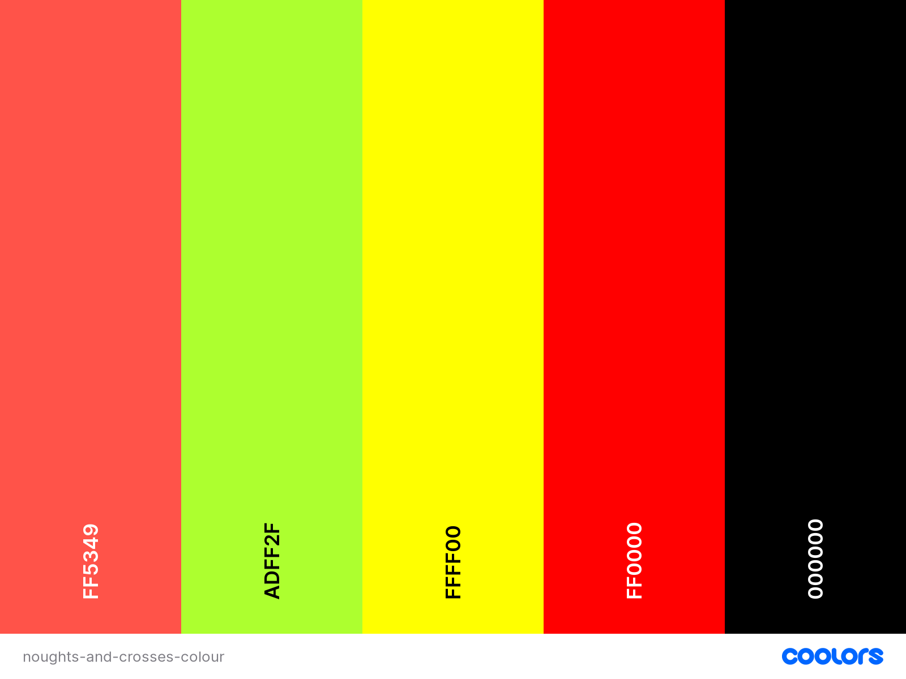
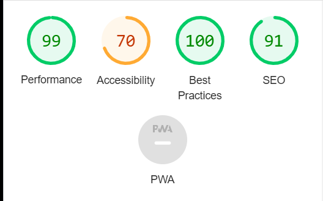
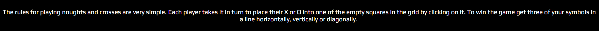
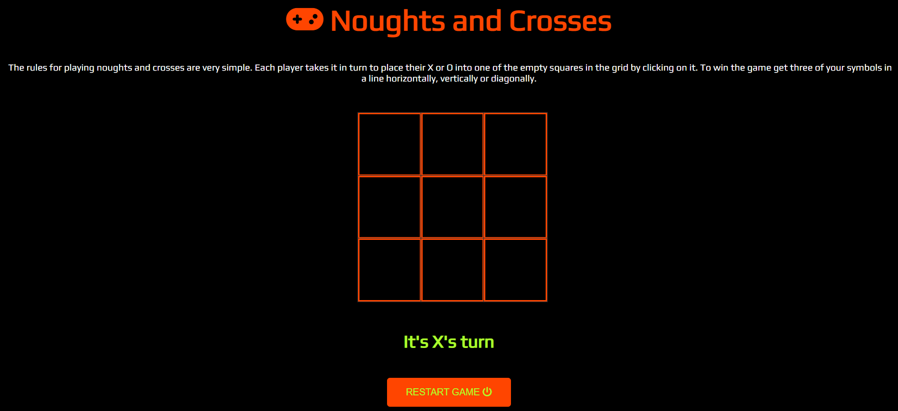

# Noughts and Crosses

## Code institute / City of Bristol College Milestone Project 2

*Created using* [Am I Responsive](http://ami.responsivedesign.is/)

Noughts and Crosses is my interactive JavaScript game created as part of my second milestone project for the full stack development course at Code Institue / City of Bristol College. I had to create an interactive web application using HTML, CSS and JavaScript.

Click <a href="https://gazerb.github.io/noughts-and-crosses/">here</a> to view the live web application.

## User Experince 
In this section, I will be providing information on the UX process. Focusing on who the PeakMotion website is for, the main aims of this project and how the website helps to meet the users needs.

The Project Goals:
<ul>
    <li>To provide access to an online noughts and crosses game</li>
    <li>Easy to understand and use</li>
    <li>appeal to all ages</li>
    <li>Fully interactive to keep people using the application</li>
</ul>

## User stories

A new user:
<ul>
    <li>I need to find a noughts and crosses game that is easy to user</li>
    <li>I need to find a noughts and crosses game that is appealing</li>
    <li>I need to know what facilities are available</li>
</ul>

#### Returning users

Current user:
<ul>
    <li>I want to be able to continue to use the game with friends</li>
</ul>

Buisness Owner:
<ul>
    <li>A noughts adn crosses game that has a retro game style with colours</li>
    <li>To be interactive and can run continuos games</li>
</ul>

## User Centered Design
### 1. Strategy Plane
The User Centered Design process started with the creation fo the user stories and these influenced the design, layout and colours of the product.

### 2. Scope Plane
Find an online version of the classic noughts and crosses game that is easy to use and understand with appealing colour schemes.

### 3. Structure Plane
After idenifying the needs of the users and visiting other local sports center websites the below features were chosen for the website:
<ul>
    <li>Child friendly and retro colour scheme</li>
    <li>Game board is easy to see</li>
    <li>Display message that shows whos turn it is</li>
    <li>Display message to show the game result and how to play again</li>
</ul>

### 4. Skeleton Page
To create the wireframes for the product I used <a href="https://www.figma.com/>">Figma</a>. They were created to appear as they would on a desktop, table and mobile.

The wireframes show the title, gameboard and display message which will change depending on the game situation. They also show a reset button to start the game again.

### Wireframes

This is how the product will look on a desktop device once completed.

This is how the product will look on a tablet device once completed.

This is how the product will look on a mobile device once completed.

### 5. Surface Plane
#### Design
As this product is considered a interactive game and most users will be on a portable device, a mobile-first approach was used.

#### Colour Scheme
The colour scheme was chosen to be simple, clean, bright and visually appealing. Blue is thr traditional colour associated with sports centers with swimming pools so this was chosen along eith white as this is a clean color. Black was chosen for the text and related icons

*Colour palette created at* [coolors.co](https://coolors.co/7ae9f0-04c6d3-fafafa-0420d4-000000).

<ul>
    <li>#FF5349 / Orangered. A nice bright color chosen for the title and background of the restart button.</li>
    <li>#ADFF2F / Greenyellow. Another bright color used for the display text below the gameboard and for the text in the restart button.</li>
    <li>#FFFF00 / Yellow. Chosen as the colour of player X.</li>
    <li>#FF0000 / Red. Chosen as the colour of player O.</li>
    <li>#000000 / Black. Chosen as the background for the application to help make the brighter colours stand out more.</li>
</ul>

#### Icons
Icons were used on this product to help improve the visual aspect and to help appeal to all ages. I used them from Font Awesome. (https://fontawesome.com/).

#### Typography
After some research, I found that the clearest font to use was 'play'. This was taken from google fonts and imported onto the style sheet and set to the boyd of the website.

## Development
Orginally the layout of the product was for the gameboard to be on the left of the screen and game display text on the right but during a mentor session i was advised that with mobile-first being the approach to change the layout to suit that device as this would more than likely be a game played on mobile devices and less likely to be desktop.

## Features
### Main Features
<ul>
    <li>Clickable gameboard to allow the players to select the square of their choice</li>
    <li>Game status text show either who's turn it is or the game result</li>
    <li>Game restart button</li>
    <li>Player Score area</li>
    <li>Ability to change which player starts</li>
</ul>

## Future Features
<ul>
    <li>Add addition game boards with different player icons so users can choose the board they want to play</li>
    <li>Add an AI so a user can play against a computer.</li>
    <li>Add the ability for the user to sign up to the site.</li>
    <li>Add online play so users can play people from all over the world.</li>
    <li>Add a score to a user account and create an online scoreboard.</li>
</ul>

## Technologies used
The below languages were used in this project:
<ul>
    <li>HTML</li>
    <li>CSS</li>
    <li>JavaScript</li>
</ul>

## websites used
<ul>
    <li>Am I Responsive (http://ami.responsivedesign.is/). This was used to create the mock up image at the top of this readme document</li>
    <li>Bootstrap (https://getbootstrap.com/). Used for website layout, responsiveness.</li>
    <li>Code Institute (https://codeinstitute.net/). Modules and walk-through projects have been used and copied in this project</li>
    <li>Coolors (https://coolors.co/7ae9f0-04c6d3-fafafa-0420d4-000000). Used to create website colour scheme and palette</li>
    <li>Font Awesome (https://fontawesome.com/). Used for icons within website</li>
    <li>Chrome Developer tools. Used to test website for buys and responsiveness</li>
    <li>Google Fonts. Used to incorporate fonts in website</li>
    <li>Github. Used for site respository and to deplay website</li>
    <li>Gitpod. Online developer tool used to build and develop this project</li>
    <li>Pexels.com. Used to collect images for this project</li>
    <li>W3C CSS Validation. Used to validate projects CSS code</li>
    <li>W3C HTML Validation. Used ti validate projects html pages / code</li>
    <li>Figma. Used to create websites wireframes</li>
</ul>

The below websites and videos were used to help code this project. Code was copied and edited to suit this product:
<ul>
    <li>https://www.geeksforgeeks.org/simple-tic-tac-toe-game-using-javascript/</li>
    <li>https://github.com/javascriptacademy-stash/tic-tac-toe</li>
    <li>https://www.youtube.com/watch?v=YcKOqthpN2M&t=3s</li>
    <li>https://dev.to/bornasepic/pure-and-simple-tic-tac-toe-with-javascript-4pgn</li>
</ul>

## Performance Testing
### Lighthouse testing
I used the chrome extension 'Lighthouse' to test the performance of the website. Below is the capture of my first report which came back with a performance of 99.

### W3C HTML Validator
No erroros on the HTML validator. There has been a warning of an empty header but our JavaScript code changes the header as it is the display test.

### W3C CSS Validator
No errors where found in the CSS code when that went through the validator so nothing was changed there.

## Manual Testing
The application was tested on the following browsers:
<ul>
    <li>Google Chrome - Version 106.0.5249.91</li>
    <li>Safari on iPhone</li>
    <li>Opera - Version 90.0.4480.80</li>
    <li>Microsoft Edge - Version 105.0.1343.53</li>
    <li>Firefox - Version 105.01</li>
</ul>

All browsers where tested fully and the application behaved as expected on them

## Device & responsiveness testing
The below devices where tested to see how the application behaved on them and their responsiveness using Google Developer Chrome tools.

<ul>
    <li>iPhone SE</li>
    <li>iPhone Xr</li>
    <li>iPhone12 Pro</li>
    <li>Pixel 5</li>
    <li>Samsung S20 Ultra</li>
    <li>iPad Air</li>
    <li>iPad Mini</li>
    <li>Surface Pro 7</li>
</ul>

It was also tested on the below laptop and desktop sizes:

<ul>
    <li>15" Laptop (1024 x 800)</li>
    <li>22" Desktop (1680 x 1050)</li>
    <li>24" Desktop (1920 x 1200)</li>
</ul>

### Tested User Stories
Below I will discuss how the project met the requirements of the user stories from earlier.

#### New User
We have already met one of the needs for a new user by having the application online. The game was created to be very simple to use and has since had the rules added above the gameboard to help new users.

#### Buisness Ower

I believe that all these have been met. We added in a font from google fonts that helps with clarity and also has a retro style to it. With the game being fully interactive and the ability to restart once completed i believe we have also met the second point for the buisness owner.

## Bugs
The only bug I found with this project was getting the squares to fill out once clicked but after reading y code it turned out to be a spleeing error within the code that has now been corrected and is working.

## Deployment
This website is currently deployed using Github Pages - https://pages.github.com/

To deploy this project to GitHub Pages I did the following:
<ol>
    <li>I logged onto the Github website and selected the PeakMotion repository from the list</li>
    <li>When in the repository, I then went to settings from the navigation bar</li>
    <li>Once in settings page, I selected pages from the left side menu</li>
    <li>This loaded Github pages. I scrolled to the build and deployment section. Under source, I changed the drop down menu to deploy from branch. Under Branch, I changed the two drop down menus to main and root folder</li>
    <li>I then clicked save and github started uploading the project to github oages and displayed the URL for the website at the top of Github pages in settings once completed</li>
</ol>

To find the website once it has been deployed you need to:
<ol>
    <li>Go to the settings of the repository</li>
    <li>Go to pages from the left menu</li>
    <li>The URL for the website will be listed at the top of this page</li>
    <li>To open the website just click the URL</li>
</ol>

## Credits
The following was used and configured to suit this project:
<ul>
    <li>https://www.geeksforgeeks.org/simple-tic-tac-toe-game-using-javascript/</li>
    <li>https://github.com/javascriptacademy-stash/tic-tac-toe</li>
    <li>https://www.youtube.com/watch?v=YcKOqthpN2M&t=3s</li>
    <li>https://dev.to/bornasepic/pure-and-simple-tic-tac-toe-with-javascript-4pgn</li>
    <li>I also used Boostrap within this project to help with layout.</li>
</ul>
